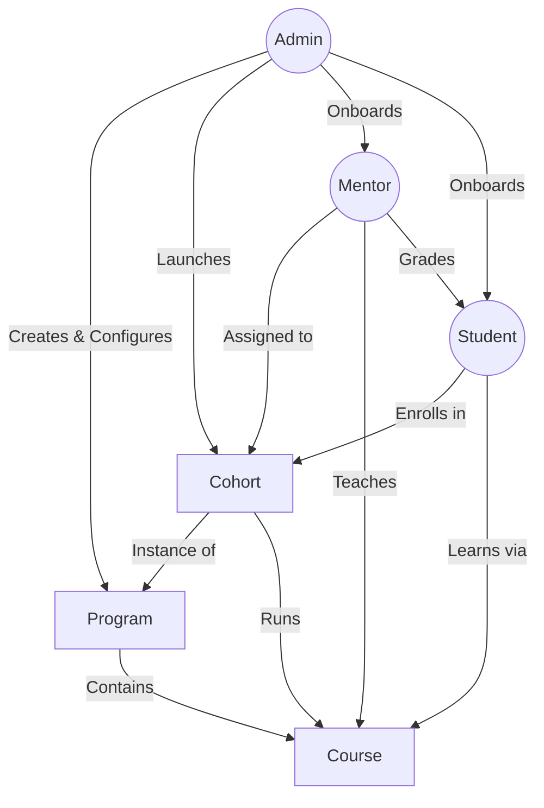
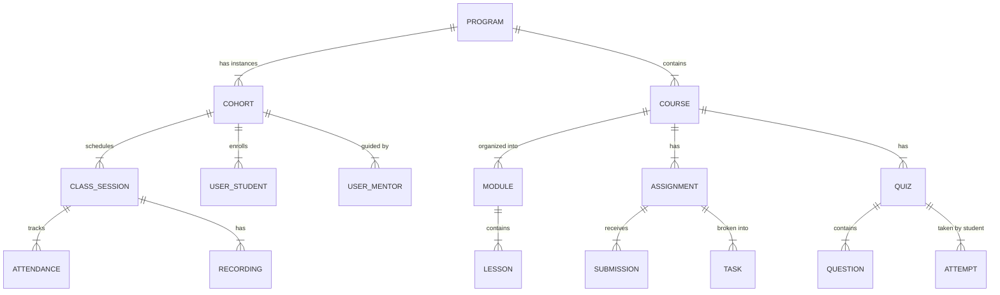

# CohortOS Architecture & Workflow Analysis

This document outlines the complete architecture of the Designient Workspace, detailing how the three primary roles (Admin, Mentor, Student) interact within the system.

## 1. High-Level Role Relationships

The system is built on a hierarchical model where **Admins** configure the infrastructure, **Mentors** facilitate learning within that infrastructure, and **Students** consume content and demonstrate progress.

---

## 2. Core Flows by Role

### A. The Admin Flow (Infrastructure & Orchestration)
The **Admin** is the architect of the learning environment. They define *what* is taught (Programs/Courses) and *who* is teaching/learning (Mentors/Students).

1.  **Curriculum Design**:
    *   Creates a **Program** (e.g., "UX Design Masterclass").
    *   Adds **Courses** to the Program (e.g., "Figma Basics", "User Research").
    *   Structures Courses into **Modules** and **Lessons**.

2.  **Cohort Management**:
    *   Creates a **Cohort** (a time-bound instance of a Program, e.g., "Fall 2024").
    *   Assigns specific **Courses** to the Cohort (activates the curriculum for this group).
    *   Assigns **Mentors** to the Cohort to lead specific courses.

3.  **User Management**:
    *   Invites **Mentors** and assigns their permissions.
    *   Invites **Students** and enrolls them into Cohorts (or approves self-enrollment).

### B. The Mentor Flow (Facilitation & Assessment)
The **Mentor** operates within an assigned Cohort. Their goal is to guide students through the pre-defined curriculum and manage day-to-day learning activities.

1.  **Class Management**:
    *   **Sessions**: Schedules and manages live class sessions.
    *   **Attendance**: Marks student attendance for each session.
    *   **Recordings**: Uploads/links class recordings for students to review.
    *   **Materials**: Uploads supplementary resources (PDFs, links) for the cohort.

2.  **Student Progress**:
    *   **Assignments**: Reviews and grades student submissions. 
    *   **Tasks**: Creates and monitors progress on specific assignment tasks (Kanban board).
    *   **Quizzes**: Creates and manages Question Banks and Quizzes.
    *   **Monitoring**: Views student profiles, attendance stats, and grade distribution.

### C. The Student Flow (Consumption & Participation)
The **Student** is the end-user. They focus on their enrolled Cohort and its Courses.

1.  **Learning**:
    *   **Dashboard**: Sees their active courses, upcoming sessions, and pending tasks.
    *   **Learn Mode**: Consumes Lessons (Notes, Video) within a Course.
    *   **Resources**: Accesses Class Recordings and Materials uploaded by the Mentor.

2.  **Action Items**:
    *   **Assignments**: Submits work for review.
    *   **Tasks**: Tracks their own progress on assignment sub-tasks (To Do -> Done).
    *   **Quizzes**: Takes timed quizzes and views results.
    *   **Attendance**: Views their own attendance record.

---

## 3. Data Architecture (Entity Relationships)

---

## 4. Technical Implementation

The platform is a **Next.js** application using **Server Actions** and **API Routes**.

*   **Authentication**: handled by **NextAuth.js** (Credentials provider).
*   **Database**: **PostgreSQL** sourced via **Prisma ORM**.
*   **Permissions**: **RBAC Middleware** (`src/lib/middleware/rbac.ts`) ensures users only access routes relevant to their role (`ADMIN`, `INSTRUCTOR`, `STUDENT`). 
    *   `ADMIN`: Access to `/dashboard/*` (Global view).
    *   `INSTRUCTOR`: Access to `/m/*` (Scoped to assigned cohorts).
    *   `STUDENT`: Access to `/s/*` (Scoped to enrolled data).
*   **Routing Proxy**: A middleware proxy (`src/proxy.ts`) intelligently redirects users to their specific portal based on their role upon login.
